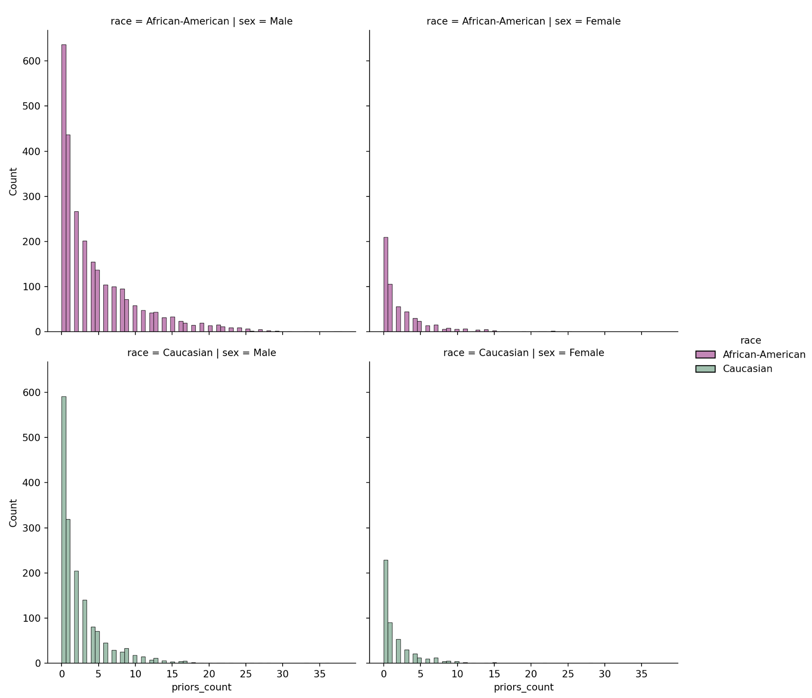
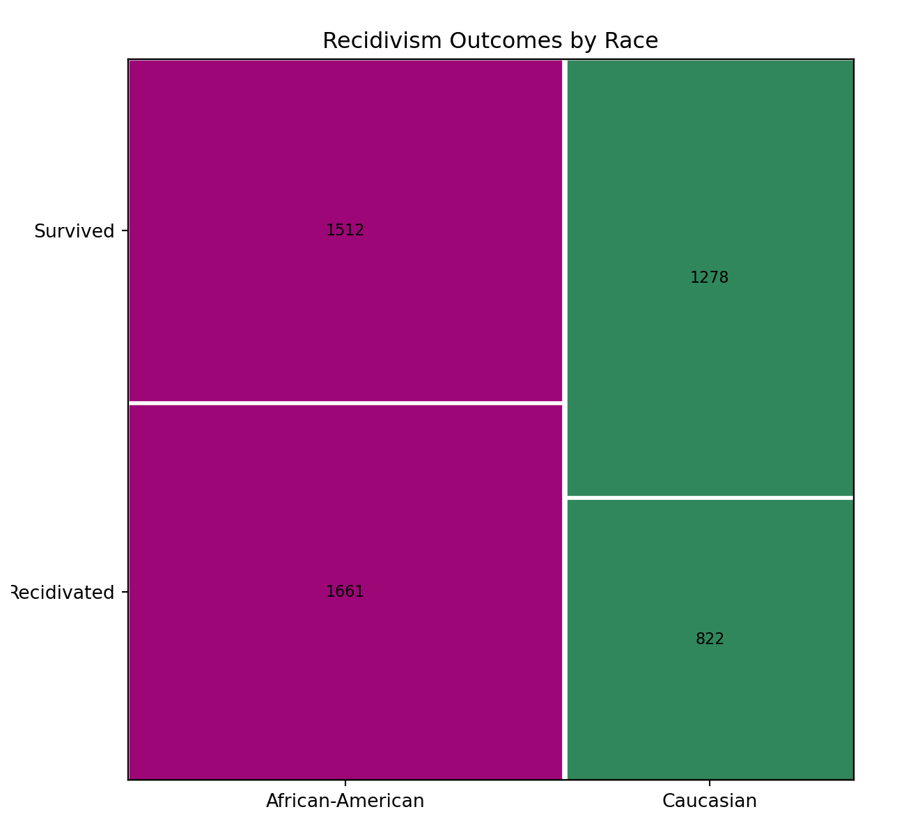
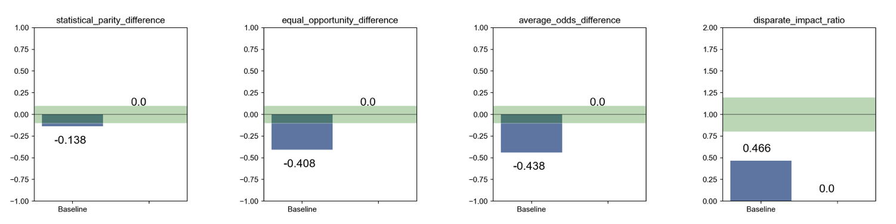
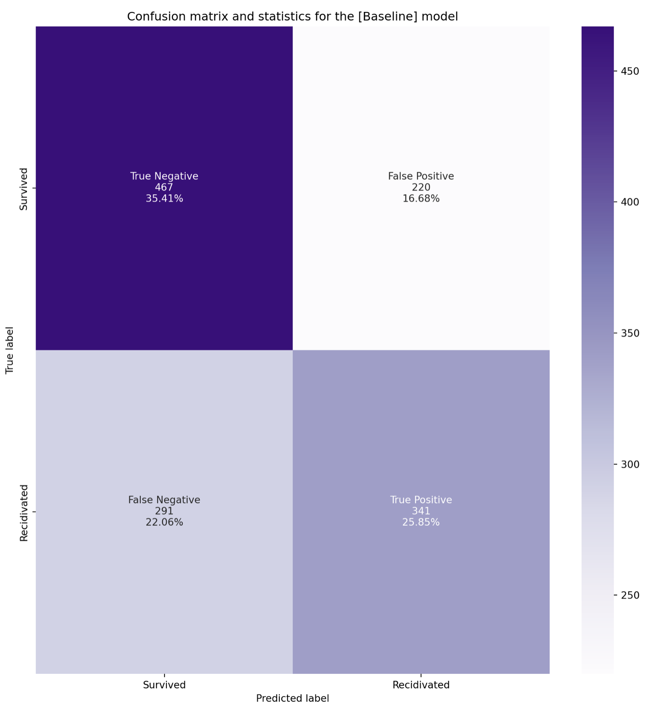
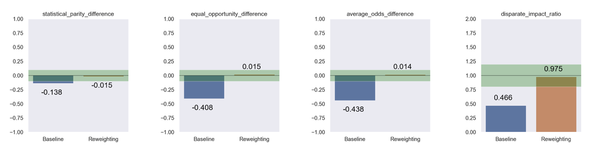
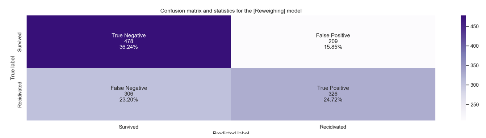
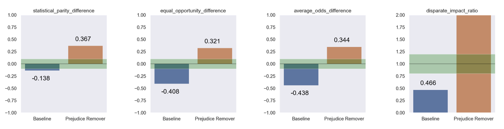
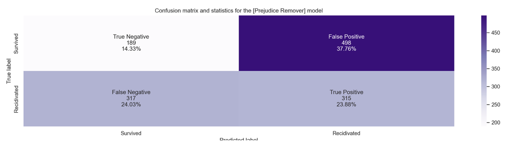
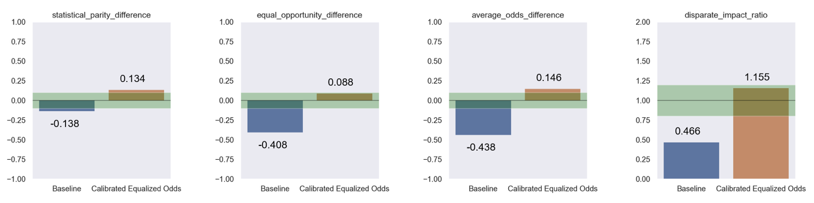
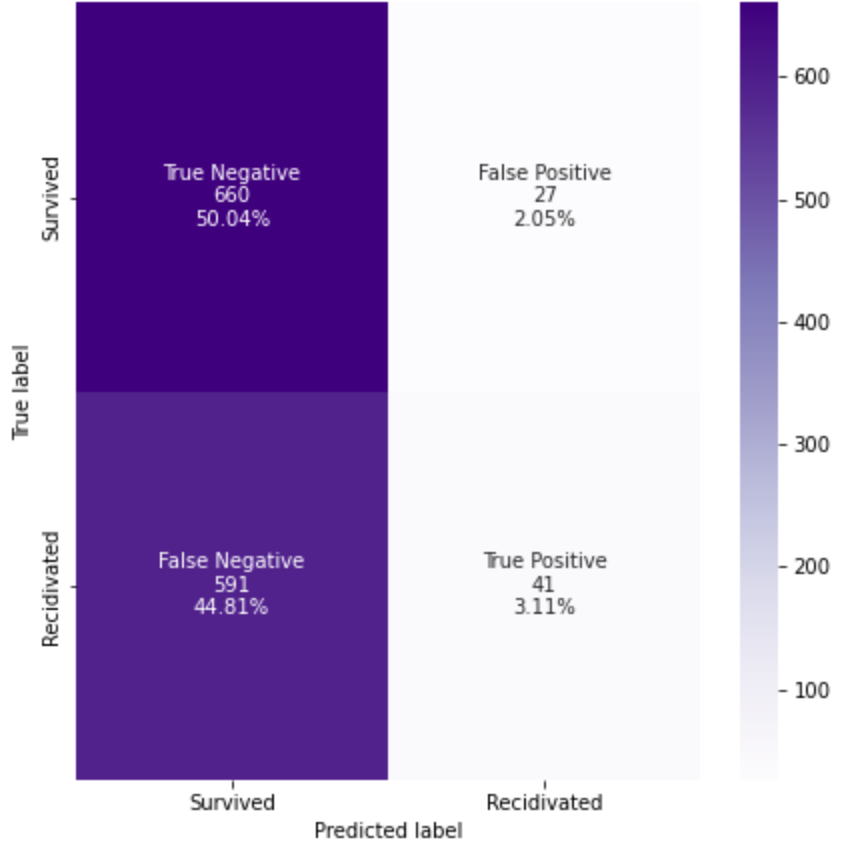

# Introduction

The Correctional Offender Management Profiling for Alternative Sanctions (COMPAS) algorithm was created by the private, for-profit company Northpointe (now known by its parent company [equivant](https://www.equivant.com/faq/)), to predict defendants’ risk of recidivism. It generates a decile score that classifies defendants’ risk of recidivism as either low, medium, or high [@angwin2016machine]. Jurisdictions across the United States use the COMPAS risk assessment instrument, including but not limited to the [New York](https://doccs.ny.gov/system/files/documents/2020/11/8500.pdf), [Massachusetts](https://hdsr.mitpress.mit.edu/pub/hzwo7ax4/release/4), [Michigan](https://hdsr.mitpress.mit.edu/pub/hzwo7ax4/release/4), [California](https://hdsr.mitpress.mit.edu/pub/hzwo7ax4/release/4), and [Wisconsin](https://doc.wi.gov/Pages/AboutDOC/COMPAS.aspx) Departments of Corrections. 

Due to the proprietary nature of the COMPAS algorithm, it is unknown how exactly these recidivism risk scores are calculated. However, a [sample COMPAS Risk Assessment Survey](https://www.documentcloud.org/documents/2702103-Sample-Risk-Assessment-COMPAS-CORE#document/p5/a296598) has been made publicly available, revealing the algorithm’s input information. @angwin2016machine critiques this survey for using proxy variables for race that do not explicitly factor in a defendant’s race but heavily imply it, allowing Northpointe to claim that their algorithm is free of racial bias. For example, the COMPAS risk assessment survey asks screeners to speculate if a defendant might be affiliated with a gang. It also asks if a defendant has any friends or family members who have been crime victims [@Angwin2016Sample]. Although these questions do not directly ask about race, they do not take into account the pervasive nature of systemic racism that infiltrates every aspect of the lives of marginalized people, thereby indirectly asking about race. 

@angwin2016machine analyzes the methods and algorithms used by Northpointe in their COMPAS risk score assessment algorithm and uncovers racial biases in defendants’ scores [@angwin2016machine]. They find that “the algorithm [is] somewhat more accurate than a coin flip,” a worrisome level of accuracy given the potential impact its determinations may have on real people’s lives. Angwin et al. specifically investigate the distribution of COMPAS scores by decile among Black and white defendants. They write: “The analysis also [shows] that even when controlling for prior crimes, future recidivism, age, and gender, black defendants [are] 45 percent more likely to be assigned higher risk scores than white defendants” [@larson2016we]. After examining the fairness metric statistical parity difference, Angwin et al. conclude that the algorithm is racially biased [@larson2016we].

@equivant_response_2016, on behalf of Northpointe, deny the allegations of racial bias and offer their own analyses based on different fairness metrics in rebuttal [@equivant_response_2016]. @angwin2016machine maintain that there are biases in the outcome values, protected attributes, and covariates during @equivant_response_2016’s data processing phase. ProPublica collaborators @larson2016we account for these biases in their analyses. In their response, @equivant_response_2016 highlight that @angwin2016machine did not account for base rates of recidivism in their analysis, which are important initial percentages without the presence of other information. 

[Women at the Table](https://www.womenatthetable.net/), the sponsor organization for this project, is “a growing, global gender equality & democracy CSO based in Geneva, Switzerland focused on advancing feminist systems change by using the prism of technology, innovation & AI exercising leverage points in technology, the economy, sustainability & democratic governance.” We are collaborating with the organization on its AI & Equality [@noauthor_ai_nodate] initiative, tasked with debiasing the COMPAS algorithm [@aif360-oct-2018] and producing a corresponding data story that will be added to its library.

Our project builds on Women at the Table’s various debiasing algorithms used in its AI & Equality Human Rights Toolbox to conduct our own analyses on the COMPAS data set. Based on this analysis, we employ a human rights framework to contribute to the ProPublica and Northpointe debate and investigate whether or to what extent there is racial bias in the COMPAS algorithm. With a solid understanding of the two sides, we aim to pinpoint the shortcomings of both arguments and correct them in our analyses. We will use various debiasing techniques and fairness metrics to evaluate the level of bias present in the COMPAS data and our algorithm. We will summarize our results using the JupyterNotebook framework from Women at the Table, to be used by members of the organization to teach in a workshop setting. We hope that our findings will highlight the importance of checking statistical analyses using varied methods and contribute to the ongoing discussion of the effects of machine biases in the justice system. 

# Data

The data we are using for this library addition is the COMPAS General Recidivism Risk Scores data set from the [AI Fairness 360](https://aif360.readthedocs.io/en/stable/modules/generated/aif360.datasets.CompasDataset.html#aif360.datasets.CompasDataset) (AIF360) toolkit. The AIF360 toolkit builds on the dataset released by ProPublica collaborators Larson et al. created to examine the racial bias and the true outcomes of the recidivism risk scores in the COMPAS algorithm for the initial ["Machine Bias"](https://www.propublica.org/article/machine-bias-risk-assessments-in-criminal-sentencing) article. For this, Larson et al. obtained two years worth of COMPAS scores from the Broward County Sheriff’s Office in Florida, as well as the corresponding intake information for each defendant including but not limited to name, sex, race, age, and charge degree and description. They also obtained data about whether defendants actually recidivated or not in the two year period following their initial COMPAS score assessment. AIF360 then processed the data with the same procedures that Larson et al. followed for their analysis. 

The raw data that we use from the AIF360 has 6,167 rows, where each row represents an arrest charge for a defendant. AIF360’s COMPAS data includes the defendant's age, race, sex, what they were charged with, and whether or not the defendant ultimately recidivated within a two-year period after their arrest. 

This exploration aims to evaluate anti-Black algorithmic bias and the differing effects of the COMPAS algorithm between white and Black defendants; as such, we filter the data to only include individuals whose race is listed as Caucasian or African-American. Our data therefore has 5,723 rows with information on defendant race, age, gender, prior crimes, and two-year recidivism rate (Figure \ref{fig:table snip}). The distributions of age (Figure \ref{fig:age plot}), prior charges (Figure \ref{fig:prior plot}), and recidivism (Figure \ref{fig:recidivism mosaic} and Table \ref{tab:recid table}) all vary by race. The average African-American defendant in our dataset is 29 years old, male, and has committed two prior crimes. The average Caucasian defendant in our dataset is 35 years old, male, and has committed one prior crime. The average defendant for both races does not have any juvenile convictions.  


```{r table snip, echo = FALSE, fig.align='center', fig.cap= "A snippet of the data set we will be using, containing information on a defendant's age, sex, race, criminal history, charge degree, charge description, and two-year recidivism outcome.", out.width= "100%"}
knitr::include_graphics("../images/table_snippet.png")
```

```{r age plot, echo=FALSE, fig.align='center', fig.cap= "The purple curve shows the distribution of the ages of Black defendants, and the green curve shows the distribution of the ages of white defendants. The probability of a defendant's age being between two points on the x-axis is the total shaded area of the curve under the two points. The purple dotted line represents the median age of Black defendants (29 years) and the green dotted line represents the median age of white defendants (35 years). For both groups, the majority of defendants are relatively young, but this is especially noticeable for Black defendants.", out.width= "100%"}
knitr::include_graphics("../images/age_race_plot_new.png")
```

```{r prior plot, echo=FALSE, fig.align = 'center', fig.cap = 'Black defendants, particularly men, are more likely to have a greater count of prior charges than white defendants. Male defendants have a higher number of prior charges than do female defendants. Though we do not know for sure which information goes into the COMPAS algorithm, it is likely that a defendant with prior charges will be coded as a having a higher risk of recidivism. Thus, by looking at the racial discrepancies in prior charges we can already see potential bias in the algorithm.', out.width= "100%"}

```

```{r recidivism mosaic, echo=FALSE, fig.align = 'center', fig.cap = 'When we divide the data into Black and white defendants, we can see that Black defendants recidivate more than white defendants and Black defendants are more likely to recidivate than not recidivate. 39.14\\% of white defendants did recidivate within two years compared to 52.35\\% of Black defendants. We can also see that there are more Black defendants in the dataset overall.', out.width= "100%"}

```

```{r, include = FALSE}
library(tidyverse)
```

```{r, include = FALSE}
x <- tribble(~`Two Year Recidivism by Race`, ~`Recidivated`, ~`Survived`, ~`Total`,
             "African American", 1661, 1512, 3173,
             "Caucasian", 822, 1278, 2100,
             "Total", 2483, 2790, 5273)
```

```{r, echo = FALSE}
knitr::kable(x, caption = "Incidence of recidivism by race, illustrating how a much greater proportion (> 50%) of Black defendants recidivated than their white counterparts. \\label{tab:recid table}")
```

# Methods

AI Fairness 360 (AIF360) is an open-source Python toolkit that seeks “to help facilitate the transition of fairness research algorithms to use in an industrial setting and to provide a common framework for fairness researchers to share and evaluate algorithms” [@aif360-oct-2018]. It contains multiple data sets, including the COMPAS data set that accompanied @angwin2016machine.

The AIF360 toolkit contains various group and individual fairness metrics as well as pre-processing, in-processing, and post-processing algorithms that we used to debias the COMPAS algorithm [@aif360-oct-2018]. Fairness metrics are mathematical measures of whether an algorithm treats members of different groups (such as racial or gender groups) equally. An algorithm has no understanding of the historical oppression of certain groups and how such bias is baked into the data on which the algorithm is trained. Thus, fairness metrics provide a method of evaluating an algorithm’s level of bias towards or against the unprivileged group versus the privileged group. We researched the definitions and applications of different fairness metrics [@ashokan2021fairness] to determine which metric would be most appropriate for our project. 

Fairness is subjective; one person might consider an algorithm fair if groups are given the same treatment, while someone else might only consider the algorithm fair if groups as a whole receive the same outcomes. In our research we choose to use the definition of group fairness as our definition for assessing fairness in the processing approach. Group fairness metrics take into account the attributes of a whole group as opposed to just one individual in the group, allowing us to represent systemic issues. In general, group fairness metrics require that the unprivileged group is treated similarly to the privileged group, whereas individual fairness metrics require individuals to be treated consistently [@kypraiou_what_2021]. Group and individual metrics work in opposition of one another, meaning that when group fairness improves, individual fairness gets worse [@kypraiou_what_2021]. We chose the following four group fairness metrics to evaluate our models. 

## Statistical Parity Difference
This metric measures the difference between privileged and marginalized groups’ likelihood to get a particular outcome. The ideal value of this metric is 0. Fairness for this metric is between -0.1 and 0.1. A negative value means there is higher benefit for the privileged group (in this case, white defendants).

$$P(\hat{Y}=1|D=Unprivileged) - P(\hat{Y}=1|D=Privileged)$$

## Disparate Impact Ratio
This metric is the ratio of how often the favorable outcome occurs in one group versus the other. In the case of recidivism, this is the ratio of how many white defendants are predicted to not recidivate compared to how many black defendants are predicted to not recidivate. A value of 1 means that the ratio is exactly 1:1. Less than 1 means the privileged group (white defendants) benefits, while a value greater than 1 means the unprivileged group (Black defendants) benefits. According to AIF360, a ratio between 0.8 to 1.25 is considered fair [@Ronaghan2019AI].

$$\frac{P(\hat{Y}=1|D=Unprivileged)}{P(\hat{Y}=1|D=Privileged)}$$

## Equal Opportunity Difference
The [equal opportunity difference](https://developers.google.com/machine-learning/glossary/fairness#e) metric is computed as the difference of true positive rates between the unprivileged and the privileged groups. The true positive rate is the ratio of true positives to the total number of actual positives for a given group.

The ideal value is 0. A value less than 0 implies higher benefit for the privileged group and a value greater than 0 implies higher benefit for the unprivileged group.
Fairness for this metric is between -0.1 and 0.1 [@aif360-oct-2018].

This metric is best used when it is very important to catch positive outcomes while false positives are not exceptionally problematic [@Cortez2019How]. This is not the case for the COMPAS data set, as false positives mean extra jail time for someone who will not actually re-offend.

$$TPR_{D = Unprivileged} - TPR_{D = Privileged}$$

## Average Odds Difference
This metric returns the average difference in false positive rate and true positive rate for the privileged and unprivileged groups. A value of 0 indicates equality of odds, and a value below 0 implies benefit for the privileged group. Equality of odds is achieved in the case of recidivism when the proportion of people who were predicted to recidivate and did recidivate is equal (true positive rate) for both Black and white defendants AND the proportion of people who were predicted to recidivate and did not recidivate (false positive rate) is equal for both Black and white defendants [@aif360-oct-2018]. 

$$\frac{1}{2}\left[(FPR_{D = Unprivileged} - FPR_{D = Privileged}) + \underbrace{(TPR_{D = Unprivileged} - TPR_{D = Privileged})}_\textrm{Equal Opportunity Difference}\right]$$

For the next step of our experiment, we sought to determine where in the data science pipeline we can mitigate the most bias, using pre-processing, in-processing, and post-processing debiasing algorithms. These are all based on using predictive models to figure out how we can “fix” the bias that is present.  

## Pre-Processing

Pre-processing refers to mitigating bias within the training data, and it is the most flexible method because it has not yet trained a model that may carry assumptions about the data. It is important to keep in mind that pre-processing prevents assumptions in the modeling, but does not account for the bias in data collection. Training data is where bias is most likely to be introduced. We use the reweighing pre-processing algorithm from AIF360 which assigns weights to the data. “The advantage of this approach is, instead of modifying the labels, it assigns different weights to the examples based upon their categories of protected attribute and outcome such that bias is removed from the training dataset. The weights are based on frequency counts. However as this technique is designed to work only with classifiers that can handle row-level weights, this may limit your modeling options” [@Ronaghan2019AI]. We used a logistic regression model for this algorithm, as it is the easiest to interpret in the given context. After running the fairness metrics using the pre-processing algorithm, we were able to compare our results to the baseline metrics from the previous section.  

## In-Processing

In-processing mitigates bias in classifiers while building a model. A classifier “is an algorithm that automatically orders or categorizes data into one or more sets” [@baxter2021AI]. The in-processing technique we use is the prejudice remover algorithm, which accounts for the fairness metric as part of the input and returns a classifier optimized by that particular metric. In order to do this, we first needed to convert our data frame into a data type called a BinaryLabelDataset.

The prejudice remover is a method for reducing indirect prejudice (i.e., how COMPAS is racially biased because it uses proxy variables for race). The prejudice remover implements two different regularizers, one to avoid overfitting and one to enforce fair classification [@kamishima2012fairness]. The prejudice remover regularizer works by minimizing the prejudice index, a mathematical equation for quantifying fairness defined by @kamishima2012fairness. This in turn enforces a classifier’s independence from sensitive information (e.g., race). Similarly to pre-processing, we compared the results of our in-processing methods with both the baseline and the pre-processing model to gauge which method so far has the better group fairness.

## Post-Processing

Our last approach, post-processing bias mitigation, is implemented after training a model. Post-processing algorithms equalize the outcomes (i.e., predicted recidivism values) to mitigate bias instead of adjusting the classifier or the training data [@baxter2021AI]. We use calibrated equalized odds, which “optimizes over calibrated classifier score outputs to find probabilities with which to change output labels with an equalized odds objective” [@aif360-oct-2018]. An equalized odds objective constrains classification algorithms such that no error type (false-positive or false-negative) disproportionately affects any population subgroup; both groups, in our case both white and Black defendants, should have the same false-positive and false-negative rates [@pleiss2017fairness]. Through the calibrated equalized odds method, we want to decrease bias while also maintaining calibration [@pleiss2017fairness]. [Calibration](https://medium.com/analytics-vidhya/calibration-in-machine-learning-e7972ac93555) refers to improving a model so that the distribution of predicted outcomes is similar to the distribution of observed probability in the training data. 

# Results

With our baseline model, we ran the four different group fairness metrics we chose and compared the results (pictured in Figre \ref{fig:baseline metrics}).

The statistical parity difference is -0.14. This indicates that there is a large difference between white and Black defendants regarding whether or not they recidivate. The algorithm unfairly benefits white defendants over Black defendants. 

Disparate impact ratio is 0.47. The ratio of white defendants predicted to not recidivate to Black defendants predicted to not recidivate is 0.47. A ratio between 0.8 and 1.25 is considered fair, therefore the algorithm unfairly benefits white defendants. 

Average odds difference is -0.44. The average difference in false positive rates and true positive rates for white and Black defendants is -0.44. Values less than zero are considered in favor of the privileged group, so the algorithm unfairly benefits white defendants. 

Equal opportunity difference is -0.41. The difference of true positive rates between the Black and white groups is -0.41. A value less than 0 indicates a benefit to the privileged group, so the algorithm benefits white defendants. The value is substantially less than -0.1, which indicates that the algorithm is unfair. 

All four group fairness metrics determine that the COMPAS algorithm favors white defendants over Black defendants. Although the magnitudes of the various fairness metrics are different, none of the metrics are within their respective fairness thresholds. Our goal is to use pre-processing, in-processing, and post-processing algorithms in the AIF360 toolkit to see if we can make COMPAS fair at all. 

Our confusion matrix for the baseline model (see Figure \ref{fig:baseline matrix}) indicates that the false positive and false negative percentages are 16.68% and 22.06%, which are the lowest values for this matrix. The highest value is the value of true positives, at 35.41%, showing that of the total number of predictions, 35.41% were correct predictions of recidivism. 

```{r baseline metrics, echo=FALSE, fig.align = 'center', fig.cap = 'Fairness Metrics of Baseline Model. For each of the four fairness metrics, the green section represents the range of fair values. The blue bars indicate the values of each of the metrics for the baseline model.', out.width= "100%"}

```

```{r baseline matrix, echo=FALSE, fig.align = 'center', fig.cap = 'Confusion Matrix of the Baseline Model', out.width= "100%"}

```

## Pre-Processing Approach: Reweighing

After running the reweighing algorithm, our fairness metrics are -0.015 for statistical parity difference, 0.015 for equal opportunity difference, 0.014 for average odds difference, and 0.98 for disparate impact ratio. All of these values now fall within the margins of fairness (see Figure \ref{fig:reweighing metrics}). These values make sense because the reweighing algorithm chooses different weights depending on whether an attribute is protected. This does an effective job of eliminating the bias, shown by each of the values in the graph being within the “fair” range of the particular fairness metric. Overall, these fairness metrics show that the reweighing algorithm improves the bias in the COMPAS algorithm. 

```{r reweighing metrics, echo=FALSE, fig.align = 'center', fig.cap = 'Fairness Metrics of Reweighing Model. For each of the four fairness metrics, the orange bars indicate the values for the reweighing model.', out.width= "100%"}

```

The highest percentage in the reweighing confusion matrix (Figure \ref{fig:reweighing matrix}) is for the percentage of true negatives, defendants who were predicted to not recidivate and actually did not, at 36.24%, 0.83% higher than the true negatives in the baseline model. This means that the reweighing model marginally improved the baseline model accuracy in predicting people who did not recidivate. However, the percentage of true positives, or those who were predicted to recidivate and did recidivate, is 24.72%, 1.13% lower than that of the baseline model. This means that the reweighing model slightly lowered the accuracy of the baseline model in predicting people who did recidivate. As a result, the overall reweighing model accuracy remains about the same as the baseline model accuracy. The false negative and false positive percentages, or the predictions that proved to be incorrect, are 23.20% and 15.85%, respectively. The re-weighing model increased the number of false negatives by 1.14% and decreased the number of false positives by 0.83%. We are most concerned about the false positives, which indicate defendants who are predicted to recidivate and do not actually recidivate. While there is a slight improvement in the percent of false positives, it is still relatively high at 15.85%, indicating that we should further precede with additional bias mitigation techniques.

```{r reweighing matrix, echo=FALSE, fig.align = 'center', fig.cap = 'Confusion Matrix of the Reweighing Model', out.width= "100%"}

```

## In-Processing Approach: Prejudice Remover

Our fairness metrics after running the prejudice remover are 0.367 for statistical parity difference, 0.321 for equal opportunity difference, 0.344 for average odds difference, and 3.3 for disparate impact ratio. Like the model performance metrics suggested, the prejudice remover approach resulted in an increased benefit for Black defendants. As the orange bars on Figure \ref{fig:prejudice metrics} show, the values of the fairness metrics have reversed from their baseline values. Now all four metrics suggest an unfair advantage for Black defendants. Thus, this approach removed the model's prejudice against Black people, but it did not result in a "fair" model. 

```{r prejudice metrics, echo=FALSE, fig.align = 'center', fig.cap = 'Fairness Metrics of Prejudice Remover Model. For each of the four fairness metrics, the orange bars indicate the values for the prejudice remover model.', out.width= "100%"}

```

The highest percentage in this confusion matrix (Figure \ref{fig:prejudice matrix}) is for false positives, defendants who the model predicted to recidivate and actually did not, at 37.76%. This false positive percentage concerns us because we do not want defendants who do not recidivate to have unfairly long sentences due to their (incorrectly) predicted recidivism. The number of true positives, defendants who the model predicted to recidivate and actually recidivated, is lower at 23.88%. The percentage of false negatives is lower, whereas the true negative is low at 14.33%. This indicates that the model does not do a good job in predicting the defendants who don't recidivate. It is very likely that it will incorrectly predict that someone will recidivate. 

```{r prejudice matrix, echo=FALSE, fig.align = 'center', fig.cap = 'Confusion Matrix of the Prejudice Remover Model', out.width= "100%"}

```

After the prejudice remover, the accuracy of the model is fairly similar across the board of races, but the model's accuracy is only 38.21%, which is much lower than the baseline and reweighing models. This accuracy score means that the model makes accurate predictions only 38% of the time.

## Post-Processing Approach: Calibrated Equalized Odds

After running the calibrated equalized odds algorithm, our fairness metrics are 0.134 for statistical parity difference, 0.088 for equal opportunity difference, 0.146 for average odds difference, and 1.155 for disparate impact ratio. As we can see in Figure \ref{fig:ceo metrics}, the calibrated equalized odds approach results in all four metrics now suggesting a benefit for the originally unprivileged group, Black defendants. Though the values for statistical parity difference and average odds difference are slightly above the range of what is considered fair, the margin is much smaller than the original margin between the value and the range of fairness (as indicated by the blue bars). Thus, the calibrated equalized odds approach successfully counteracts the bias against Black defendants and results in a mostly fair model.

```{r ceo metrics, echo=FALSE, fig.align = 'center', fig.cap = 'Fairness Metrics of Calibrated Equalized Odds Model. For each of the four fairness metrics, the orange bars indicate the values for the calibrated equalized odds model.', out.width= "100%"}

```

The highest percentage in this confusion matrix (Figure \ref{fig:ceo matrix}) is for true negatives, defendants who the model predicted to not recidivate and actually did not, at 50.04%. The number of true positives, defendants who the model predicted to recidivate and actually recidivated, is much lower at 3.11%. The percentage of false negatives is somewhat high for this baseline model, whereas the amount of false positives is very low at 2.05%. This indicates that the model does a good job in predicting the defendants who don't recidivate. It is very unlikely that it will incorrectly predict that someone will recidivate. Though the accuracy score for the model is 0.53, lower than the baseline, this model is much better at identifying true negatives. 

```{r ceo matrix, echo=FALSE, fig.align = 'center', fig.cap = 'Confusion Matrix of the Calibrated Equalized Odds Model', out.width= "100%"}

```

# Conclusion

## Limitations

Our project tries to mitigate bias within existing data, rather than within the methods used to collect this data. The data are collected using a risk assessment survey, where defendants are asked a series of questions (see introduction) which are supposedly used to determine whether someone will recidivate or not. Many of these questions involve proxy variables for race. The creation and facilitation of this survey can therefore be assessed for bias mitigation as the methods used may potentially privilege some groups over others. As a result, the bias exists even before values are collected, limiting the debiasing work able to be done on the output values. 

Furthermore, AIF360 processed the data we used in this project the same way ProPublica processed their data. AIF360 simplifies the original defendant data and their COMPAS scores to make the data easier to analyze. However, this initial processing may lose some details captured in the original raw data. As we have noted throughout this paper, bias can be introduced in any step of the data science pipeline and AIF360’s initial data processing step is no exception.

AIF360 contains an array of processing methods that have been written by various scholars of fairness [@aif360-oct-2018]. These methods are each distinct and apply a different technique to mitigate bias. Our results only contain three processing methods, one for each step in processing. This choice was based on time constraints as well as our working environment. For example, the code for most of the other in-processing methods would not run for us. In-processing on its own works to debias an algorithm, not the input or output values, so some of those methods may not work on certain algorithms. We had similar challenges with pre and post-processing, where the methods were challenging to run and would require more time to be spent debugging in order to make them work. Had we used alternative processing methods, our results would be quite different, as the method changes apply a different mathematical technique to the input. 
	
## Future Work

In this project, we have only focused on a few select fairness metrics and a few debiasing algorithms. We looked at group fairness metrics because we specifically wanted to mitigate systemic racial bias in the COMPAS algorithm, but other researchers could compare how well debiasing algorithms work using individual fairness metrics. Future work could also include conducting more tests using other debiasing algorithms to see if the COMPAS algorithm could be made more fair. One significant limitation of our work is that some of the in-processing algorithms provided in the AIF360 toolkit were difficult to integrate into our code and we were unable to run many of them. The processing methods we chose, though effective, were based on our work environments, and there are other existing algorithms that attempt to mitigate bias. 

We only looked at defendants labeled as Caucasian and African-American in our dataset, which diminishes the generalizability and nuance of our results. Comparing how COMPAS assesses defendants of other races would be an incredibly relevant extension of our existing work. Furthermore, @larson2016we also found that age was the most predictive factor of a higher risk score: “Defendants younger than 25 years old were 2.5 times as likely to get a higher score than middle aged offenders, even when controlling for prior crimes, future criminality, race and gender” [@larson2016we]. In addition, female defendants were more likely to receive a higher recidivism risk score than male defendants when controlling for the aforementioned factors [@larson2016we]. Thus, some extensions of our work could include attempting to remove age and gender bias and determining the most effective processing algorithms to do so.

The dataset we are working with only contains defendants’ criminal history records from Broward County, Florida. Many other states, including New York and Massachusetts, use COMPAS to calculate recidivism scores, and a further study could apply this paper’s methods to the data coming out of other states. By conducting experiments on multiple states the baseline model would be trained on a larger and more diverse set of data, which could improve its accuracy. In addition, by adding more geographically diverse data to our set we can start to create more generalizable conclusions about our results. However, future researchers must keep in mind the real-life consequences of recidivism risk algorithms like COMPAS and how research on methods of debiasing algorithms could potentially be utilized to justify the continued use of biased algorithms.

## Final Thoughts

Through our methods, we concluded that the pre-processing and post-processing methods mitigate bias and increase fairness most successfully. The in-processing technique was effective at mitigating bias, but did not result in a mathematically fair model. However, these techniques only treat the symptoms of racial bias in the justice system, as opposed to addressing the root cause, systemic racism. We need to question why these flawed algorithms exist and why they can be used to determine someone’s fate in the justice system. While we may have methods for reducing bias algorithms such as COMPAS, the focus should be on addressing the over-policing and over-criminalization of Black communities that result in biased data and algorithms. 

## Ethical Statement

Throughout this project, we endeavored to debias an incredibly powerful algorithm that can change the course of someone’s life. However, we want to recognize that debiasing methods are not the most effective or beneficial way to uproot bias within the American justice system. The problems within the justice system are much more complex than an algorithm and are rooted in the United States’s history of racism. In addition, algorithmic bias is much more complex than the algorithm itself; algorithmic bias comes from the people who produce the algorithm. We all have our own beliefs, biases, and situated knowledge that impact and subsequently limit everything we create.

# Acknowledgements

We would like to thank our sponsor organization Women At The Table and Professor Ben Baumer for introducing us to this incredibly meaningful work, supporting us, and answering the many questions we had throughout this semester-long project. We would specifically like to thank Sofia Kypraiou for her mentorship and patience throughout this process. 

# Bibliography

