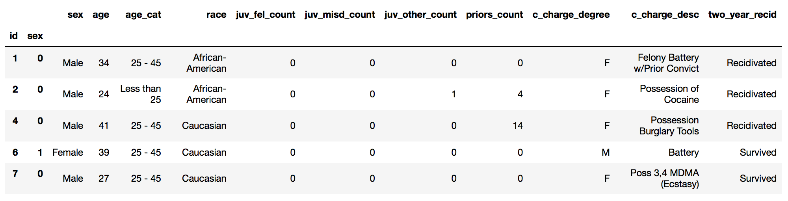
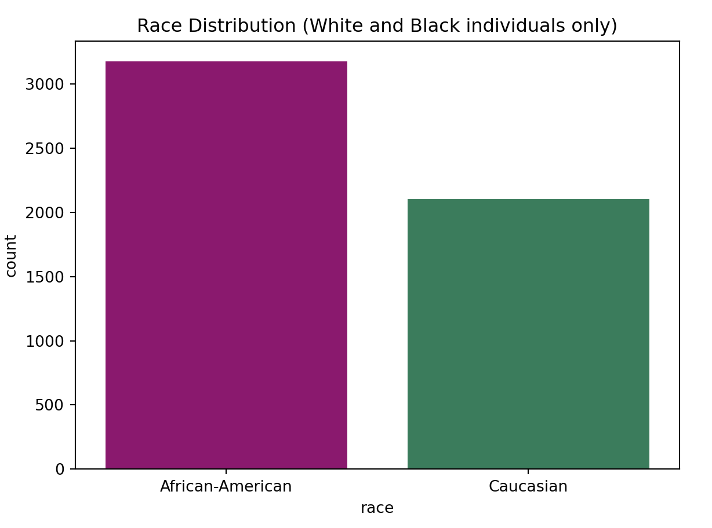
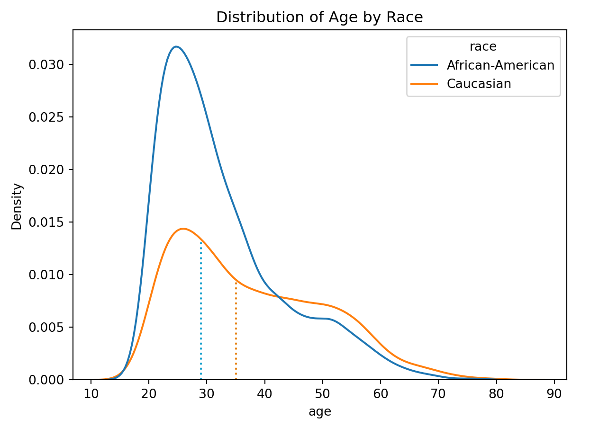
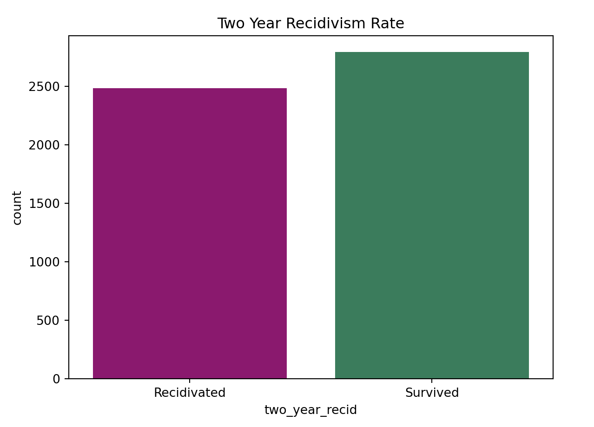
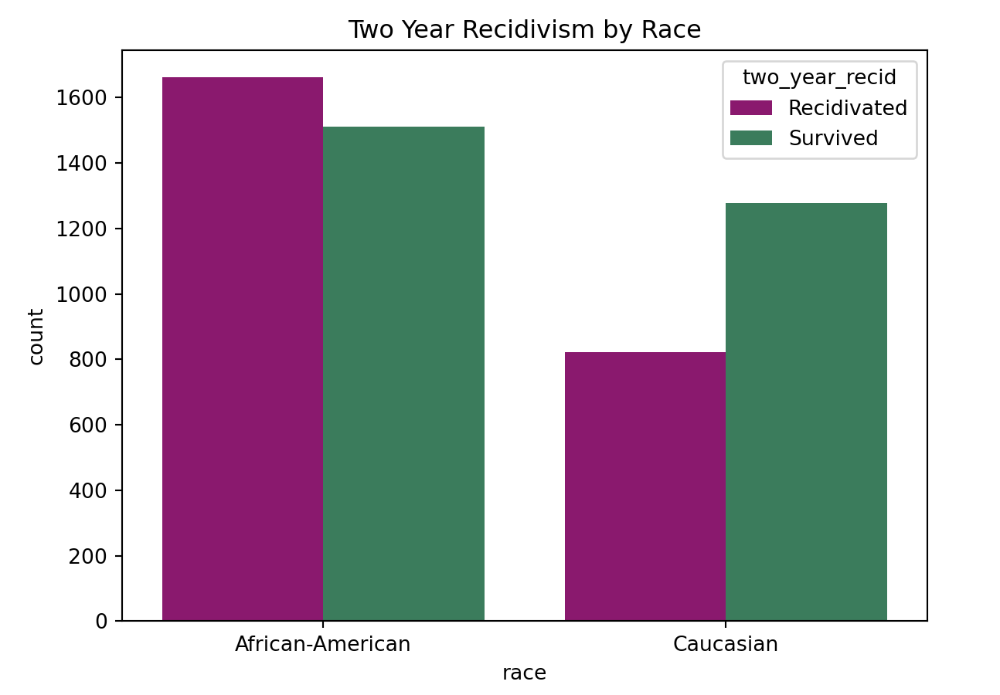

# Introduction

The Correctional Offender Management Profiling for Alternative Sanctions (COMPAS) algorithm was created by the private, for-profit company Northpointe (now known by its parent company [Equivant](https://www.equivant.com/faq/)), to predict defendants’ risk of recidivism. It generates a decile score that classifies defendants’ risk of recidivism as either low, medium, or high [@angwin2016machine]. Jurisdictions across the United States use the COMPAS risk assessment instrument, including but not limited to the New York [@NYDOCCS2019], Massachusetts, Michigan, California [@Jackson2020Setting], and Wisconsin [@WisconsinDOC] Departments of Corrections. 

Due to the proprietary nature of the COMPAS algorithm, it is unknown how exactly these recidivism risk scores are calculated; however, a sample COMPAS Risk Assessment Survey has been made publicly available, revealing the algorithm’s input information. This survey has been widely critiqued for using proxy variables for race that do not explicitly factor in a defendant’s race but heavily imply it, allowing Northpointe to claim that their algorithm is free of racial bias. For example, the COMPAS risk assessment survey asks screeners to speculate if a defendant might be affiliated with a gang. It also asks if a defendant has any friends or family members who have been crime victims [@Angwin2016Sample]. Although these questions do not directly ask about race, they do not take into account the pervasive nature of systemic racism that infiltrates every aspect of the lives of marginalized people, thereby indirectly asking about race. 
@angwin2016machine. published a 2016 piece in the news publication ProPublica that analyzes the methods and algorithms used by Northpointe in their COMPAS risk score assessment algorithm and uncovers the racial biases in defendants’ scores [@angwin2016machine]. Their research finds that “the algorithm [is] somewhat more accurate than a coin flip,” a worrisome level of accuracy given the potential impact its determinations may have on real people’s lives. @angwin2016machine specifically investigate the distribution of COMPAS scores by decile among Black and white defendants. They write: “The analysis also [shows] that even when controlling for prior crimes, future recidivism, age, and gender, Black defendants [are] 45 percent more likely to be assigned higher risk scores than white defendants” [@larson2016we]. After examining the fairness metric statistical parity difference, @angwin2016machine conclude that the algorithm is racially biased [@larson2016we]. 

@equivant_response_2016, on the behalf of Northpointe, deny the allegations of racial bias and offer their own analyses based on different fairness metrics in rebuttal [@equivant_response_2016]. @angwin2016machine maintain that there are biases in the outcome values, protected attributes, and covariates during @equivant_response_2016’s data processing phase. ProPublica collaborators @larson2016we account for these biases in their analyses. In their response, @equivant_response_2016 highlight that @angwin2016machine did not account for base rates of recidivism in their analysis, which are important to understand initial percentages without the presence of other information. 

[Women at the Table](https://www.womenatthetable.net/), the sponsor organization for this project, is “a growing, global gender equality & democracy CSO based in Geneva, Switzerland focused on advancing feminist systems change by using the prism of technology, innovation & AI exercising leverage points in technology, the economy, sustainability & democratic governance.” We are collaborating with the organization on its AI & Equality [@noauthor_ai_nodate] initiative, tasked with de-biasing the COMPAS algorithm [@aif360-oct-2018] and producing a corresponding data story that will be added to its library. 
Our project builds on Women at the Table’s various de-biasing algorithms used in its AI & Equality Human Rights Toolbox to conduct our own analyses on the COMPAS data set. Based on this analysis, we employ a human rights framework to contribute to the ProPublica and Northpointe debate and investigate whether or to what extent there is racial bias in the COMPAS algorithm. With a solid understanding of the two sides, we aim to pinpoint the shortcomings of both arguments and correct them in our analyses. We will use various de-biasing techniques and fairness metrics to evaluate the level of bias present in the COMPAS data and our algorithm. We will summarize our results using the JupyterNotebook framework from Women at the Table, to be used by members of the organization to teach in a workshop setting. We hope that our findings will highlight the importance of checking statistical analyses using varied methods and contribute to the ongoing discussion of the effects of machine biases in the justice system. 

# Data

The data we are using for this project is the COMPAS General Recidivism Risk Scores data set from the AI Fairness 360 (AIF360) toolkit [@aif360-oct-2018], which does the same initial pre-processing as ProPublica. The raw data has 6,167 rows and each row represents an arrest charge for a defendant. AIF360’s COMPAS data includes the defendant's age, race, sex, prior charges, what they were charged with, and whether or not the defendant ultimately recidivated within a two-year period after their arrest. For the purposes of our project, which endeavors to evaluate the differing effects of the COMPAS algorithm on white defendants versus Black defendants, we have filtered the data to only include individuals whose race is listed as Caucasian or African-American. Our data therefore has 5,723 rows (Figure \ref{fig:table snip}), with the below distributions of race (Figure \ref{fig:race plot}), age (Figure \ref{fig:age plot}), and two year recidivism rate (Figures \ref{fig:recid plot} & \ref{fig:recid race plot} and Table \ref{tab:recid table}).

```{r table snip, echo = FALSE, fig.align='center', fig.cap= "This table is a snippet of the data set we will be using, containing information on a defendant's age, sex, race, criminal history, charge degree, charge description, and two year recidivism outcome.", out.width= "100%"}

```

```{r race plot, echo=FALSE, fig.align='center', fig.cap= 'This plot shows the distribution of defendant races. The dataset contains about 3200 Black defendants and 2100 white defendants. Therefore, there are more Black people represented in the dataset than white people.', out.width= "100%"}

```

```{r age plot, echo=FALSE, fig.align='center', fig.cap= "This plot shows the distribution of defendant ages by race. The purple curve shows the distribution of the ages of Black defendants, and the green curve shows the distribution of the ages of white defendants. The probability of a defendant's age being between two points on the x-axis is the total shaded area of the curve under the two points. The purple dotted line represents the median age of Black defendants (29 years) and the green dotted line represents the median age of white defendants (35 years). For both groups, the majority of defendants are relatively young, but this is especially noticeable for Black defendants.", out.width= "100%"}

```

```{r recid plot, echo=FALSE, fig.align='center', fig.cap= 'This plot shows the distribution of two year recidivism outcomes. Out of all defendants, there is a higher proportion of people who did not recidivate than who did. About 2500 people recidivated, whereas approximately 2700 did not.', out.width= "100%"}

```

```{r recid race plot,echo=FALSE, fig.align='center', fig.cap= 'This plot shows the distribution of two year recidivism outcomes by race. When we divide the data into Black and white defendants, we can see that Black defendants recidivate more than white defendants and Black defendants are more likely to recidivate than not recidivate. We can also see that there are more Black defendants in the dataset overall.', out.width= "100%"}

```

```{r, include = FALSE}
library(tidyverse)
```

```{r, include = FALSE}
x <- tribble(~`Two Year Recidivism by Race`, ~`Recidivated`, ~`Survived`,
             "African American", "1661", "1512",
             "Caucasian", "822", "1278")
```

```{r, echo = FALSE}
knitr::kable(x, caption = "This table shows the counts of recidivism by race, illustrating how a much greater proportion (> 50%) of Black defendants recidivated than their white counterparts. \\label{tab:recid table}")
```

# Methods

AI Fairness 360 (AIF360) is an open-source Python toolkit that seeks to "to help facilitate the transition of fairness research algorithms to use in an industrial setting and to provide a common framework for fairness researchers to share and evaluate algorithms" [@aif360-oct-2018]. It contains multiple data sets, including the COMPAS data set that accompanied the @angwin2016machine piece. Using the @reticulate package, we conduct our analysis in an RMarkdown document with Python code. 

The AIF360 toolkit contains various group and individual fairness metrics as well as pre-processing, in-processing, and post-processing algorithms that we used for our experiments [@aif360-oct-2018]. We researched the definitions and applications of different fairness metrics [@ashokan2021fairness] to determine which metric would be most appropriate for our project. We chose to look at four group fairness metrics instead of individual fairness metrics. Group fairness takes into account the attributes of a whole group as opposed to just one individual in the group, allowing us to represent more of the systemic issues happening. In general, group fairness metrics require that the unprivileged group is treated similarly to the privileged group, whereas individual fairness metrics require individuals to be treated consistently [@kypraiou_what_2021]. Group and individual metrics work in opposition of one another, meaning that when group fairness improves, individual fairness gets worse.

**Statistical Parity Difference** - This metric measures the difference that the majority and protected classes get a particular outcome. The ideal value of this metric is 0. Fairness for this metric is between -0.1 and 0.1. A negative value means there is higher benefit for the privileged group (in this case, white defendants).

$$P(\hat{Y}=1|D=Unprivileged) - P(\hat{Y}=1|D=Privileged)$$

**Disparate Impact Ratio** - This metric is the ratio of how often the favorable outcome occurs in one group versus the other. In the case of recidivism, this is the ratio of how many white defendants are predicted to not recidivate compared to how many Black defendants are predicted to not recidivate. A value of 1 means that the ratio is exactly 1:1. Less than 1 means the privileged group (white defendants) benefits, while a value greater than 1 means the unprivileged group (Black defendants) benefits. According to AIF360, a ratio between .8 to 1.25 is considered fair[@Ronaghan2019AI].

$$\frac{P(\hat{Y}=1|D=Unprivileged)}{P(\hat{Y}=1|D=Privileged)}$$

**Average Odds Difference** - This metric returns the average difference in false positive rate and true positive rate for the privileged and unprivileged groups. A value of 0 indicates equality of odds, and a value below 0 implies benefit for the privileged group. Equality of odds is achieved in the case of recidivism when the proportion of people who were predicted to recidivate and did recidivate is equal (true positive rate) for both Black and white defendants AND the proportion of people who were predicted to recidivate and did not recidivate (false positive rate) is equal for both Black and white defendants[@aif360-oct-2018]. 

$$\frac{(FPR_{D = unprivileged} - FPR_{D = privileged}) + (TPR_{D = unprivileged} - TPR_{D = privileged})}{2}$$

**Equal Opportunity Difference** - This metric is computed as the difference of true positive rates between the unprivileged and the privileged groups. The true positive rate is the ratio of true positives to the total number of actual positives for a given group[@GoogleDev].

The ideal value is 0. A value less than 0 implies higher benefit for the privileged group and a value greater than 0 implies higher benefit for the unprivileged group.
Fairness for this metric is between -0.1 and 0.1 [@aif360-oct-2018].

This metric is best used when it is very important to catch positive outcomes while false positives are not exceptionally problematic [@Cortez2019How]. This is not the case for the COMPAS data set, as false positives mean extra jail time for someone who will not actually re-offend.

$$TPR_{D = Unprivileged} - TPR_{D = Privileged}$$

For the next step of our experiment, we need to determine where in the data science pipeline we can mitigate the most bias, using pre-processing, in-processing, and post-processing de-biasing algorithms. These are all based on using predictive models to figure out how we can “fix” the bias that is present. 

Pre-processing refers to assessing the training data, and it is the most flexible method because it has not yet trained a model that may carry assumptions about the data. It is important to keep in mind that pre-processing prevents assumptions in the modeling, but does not account for the bias in data collection. With pre-processing, we use the re-weighing algorithm from AIF360 which weights the examples in each (group, label) combination differently to ensure fairness before classification [@aif360-oct-2018]. We use a logistic regression model for this algorithm, as it is the easiest to interpret in the given context. After running the fairness metrics using the pre-processing algorithm, we are able to compare our results to the baseline metrics from the previous section. 

Another approach, in-processing, explores how bias can be targeted while building a model. It assesses how we build learning algorithms, which often prioritize accuracy over fairness. The technique we use is the Meta Classification algorithm, which accounts for the fairness metric as part of the input and returns a classifier optimized by that particular metric. Similarly to pre-processing, we compare the results of our in-processing methods with both the baseline and the pre-processing to gauge which method so far has better individual or group fairness. 

Our last approach, post-processing, makes transformations on model outputs. Similarly to the pre-processing, it is flexible because it does not work directly with the algorithm, but instead has direct access to all the predicted classification values. Because the algorithms are often so complex and difficult to interpret, post-processors are trained in a black box. To get around this, we use the PostProcessingMeta class from AIF360 which combines the training and prediction for a random estimator and the post-processor while simultaneously splitting the data set [@aif360-oct-2018]. Based on these results, we look comparatively at all the approaches to determine which we assess to be the most fair. 

# Preliminary Results

With our baseline model, we ran the four different group fairness metrics we chose and compared the results (pictured in Table \ref{tab:baseline metrics table}))

The statistical parity difference is -0.14. This indicates that there is a large difference between white and Black defendants regarding whether or not they recidivate. The algorithm unfairly benefits white defendants over Black defendants. 
Disparate impact ratio is 0.47. The ratio of white defendants predicted to not recidivate to the Black defendants predicted to not recidivate is 0.47. A ratio between 0.8 and 1.25 is considered fair, therefore the algorithm unfairly benefits white defendants. 

Average odds difference is -0.44. The average difference in false positive rates and true positive rates for white and Black defendants is -0.44. Values less than zero are considered in favor of the privileged group, so the algorithm unfairly benefits white defendants. 

Equal opportunity difference is -0.41. The difference of true positive rates between the Black and white groups is -0.41. A value less than 0 indicates a benefit to the privileged group, so the algorithm unfairly benefits white defendants. The value is substantially less than -0.1, which indicates that the algorithm benefits white defendants. 

All four group fairness metrics determine that the COMPAS algorithm favors white defendants over Black defendants. The statistical parity metric indicates unfairness by a smaller margin of 0.04 than equal opportunity difference which has a margin of error 0.4 below the threshold. Although this is true, each algorithm uses different penalties for unfavorable outcomes, so the higher the penalty the more of a difference there will be between the fairness threshold and the value. 

```{r, echo = FALSE}
baseline_metrics <- tribble(~`Fairness Metric`, ~`Ideal Value`, ~ `Baseline Value`, ~`Benefited Group`,
             "Statistical Parity Difference", "0", "-0.14", "White Defendants",
             "Disparate Impact Ratio", "1", "0.47", "White Defendants",
             "Average Odds Difference", "0", "-0.44", "White Defendants",
             "Equal Opportunity Difference", "0", "-0.41", "White Defendants")
```

```{r, echo = FALSE}
knitr::kable(baseline_metrics, caption = "Results of Baseline Fairness Metric Analysis \\label{tab:baseline metrics table}")
```

# Bibliography
