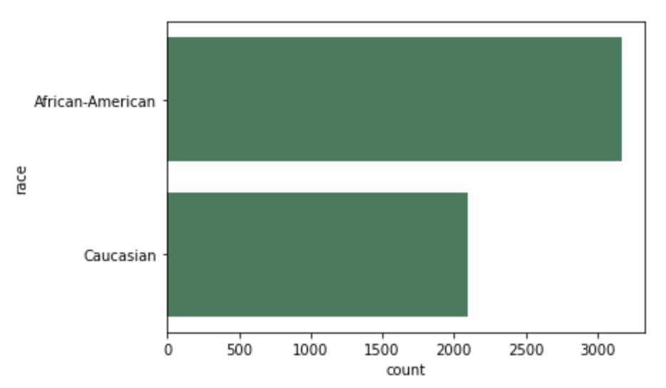
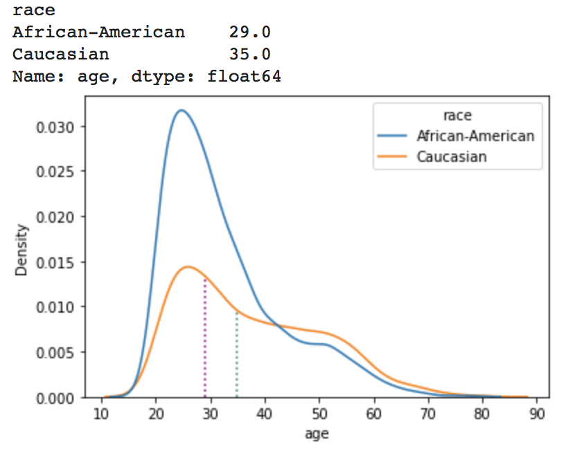
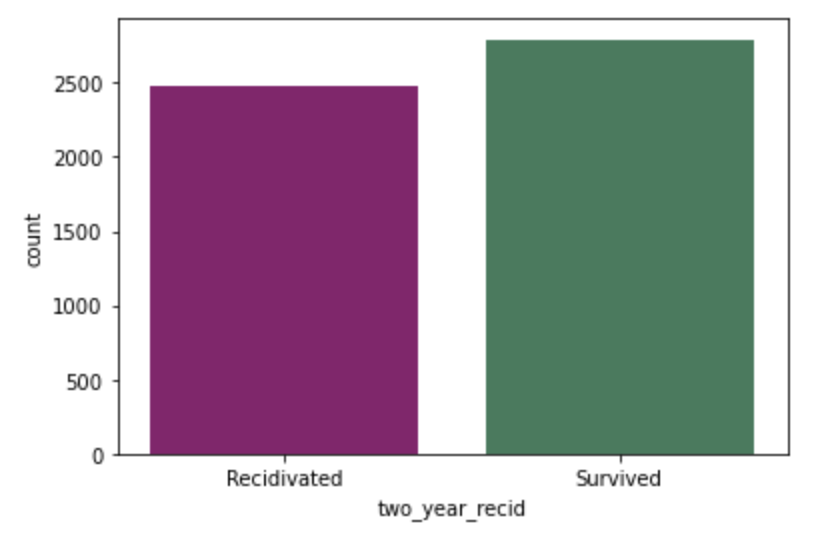
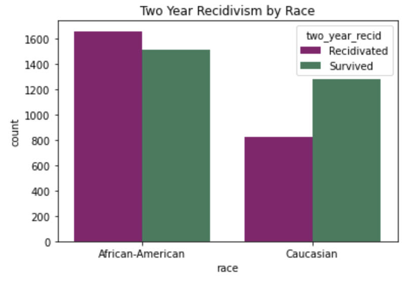

# Introduction

Women @ the Table, the sponsor organization for this project, is “a growing, global gender equality & democracy CSO based in Geneva, Switzerland focused on advancing feminist systems change by using the prism of technology, innovation & AI exercising leverage points in technology, the economy, sustainability & democratic governance” [@noauthor_womenthetable_nodate]. We have been asked to collaborate on their AI & Equality [@noauthor_ai_nodate] initiative, tasked with debiasing the COMPAS algorithm [@noauthor_aif360datasetscompasdataset_2018] and producing a corresponding data story that will be added to their library. 

The Correctional Offender Management Profiling for Alternative Sanctions (COMPAS) algorithm was created by the private for-profit company Northpointe, also known by its parent company Equivant [@equivant_faq_nodate], to predict defendants’ risk of recidivism. It generates a score that classifies defendants’ risk of recidivism as either low, medium, or high [@angwin2016machine]. Jurisdictions across the United States use the COMPAS risk assessment instrument. In 2016, ProPublica published a piece that analyzed the methods and algorithms used by Northpointe to uncover racial biases in defendants’ scores [@angwin2016machine]. Their analysis looks at the distribution of decile COMPAS scores among Black and white defendants. ProPublica concludes, after using a statistical parity metric on false positives or false negatives, that the algorithm is racially biased [@larson2016we]. Northpointe denies the allegations of racial bias, conducting their own analyses based on different statistical parity metrics [@equivant_response_2018]. Since then, the two parties have had several exchanges, maintaining their original arguments. Currently, the two parties’ disagreement focuses on pretrial Risk Assessment Instruments (RAIs). ProPublica maintains that there are biases in the outcome values, protected attributes, and covariates during Northpointe’s data processing phase. ProPublica accounts for these biases in their analyses, and Northepointe’s response, highlights how ProPublica did not account for base rates of recidivism in their analysis, which are important to understand initial percentages without the presence of other information. 

Our project builds on Women at the Table’s various debiasing algorithms to conduct our own analyses on the COMPAS dataset. Based on this analysis, we employ a human rights framework to contribute to the ongoing ProPublica and Northpointe debate and investigate whether or to what extent there is racial bias in the COMPAS algorithm. With a solid understanding of the two sides, we aim to pinpoint the shortcomings of both arguments and correct them in our analyses. We will use various machine learning algorithms including logistic regression, cross validation, and lasso and ridge techniques to choose models. We will summarize our results using the JupyterNotebook framework from Women at the Table, to be used by members of the organization to teach in a workshop setting. We hope that our findings will highlight the importance of checking statistical analyses using varied methods and contribute to the ongoing discussion of the effects of machine biases in the justice system.

# Data

The data we are using for this project is the COMPAS General Recidivism Risk Scores dataset from ProPublica used in their original analysis [@larson_propublicacompas-analysiscompas-scores-two-yearscsv_2022]. The COMPAS dataset we are using is from AI Fairness 360 (AIF360) toolkit [@noauthor_trusted-ai_360] which does the same initial preprocessing as ProPublica. The raw data has 6,167 rows and each row represents an arrest charge for a defendant. ProPublica’s COMPAS data includes the defendant's age, race, sex, what they were charged with, and whether or not the defendant ultimately recidivated within a two-year period after their arrest. For the purposes of our project, which endeavors to evaluate the differing effects of the COMPAS algorithm on white defendants and Black defendants, we have filtered the data to only include individuals whose race is listed as Caucasian or African-American. Our data therefore has 5,723 rows (Figure \ref{fig:table snip}), with the below distributions of race (Figure \ref{fig:race plot}), age (Figure \ref{fig:age plot}), and two year recidivism rate (Figures \ref{fig:recid plot} & \ref{fig:recid race plot}).

```{r table snip, echo = FALSE, fig.align='center', fig.cap= 'This table is a snippet the data set we will be using.', out.width= "400px", out.height= "200px"}
knitr::include_graphics("../images/table_snippet.png")
```

```{r race plot, echo=FALSE, fig.align='center', fig.cap= 'This plot shows the distribution of defendant races.', out.width= "400px", out.height= "200px"}

```

```{r age plot, echo=FALSE, fig.align='center', fig.cap= 'This plot shows the distribution of defendant ages by race.', out.width= "400px", out.height= "200px"}

```

```{r recid plot, echo=FALSE, fig.align='center', fig.cap= 'This plot shows the distribution of two year recidivism outcomes.', out.width= "400px", out.height= "200px"}

```

```{r recid race plot,echo=FALSE, fig.align='center', fig.cap= 'This plot shows the distribution of two year recidivism outcomes by race.', out.width= "400px", out.height= "200px"}

```

# Results

# Discussion

# Conclusion

# Bibliography
